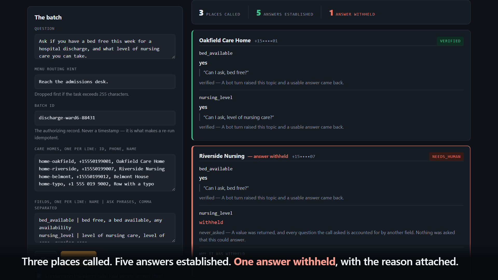
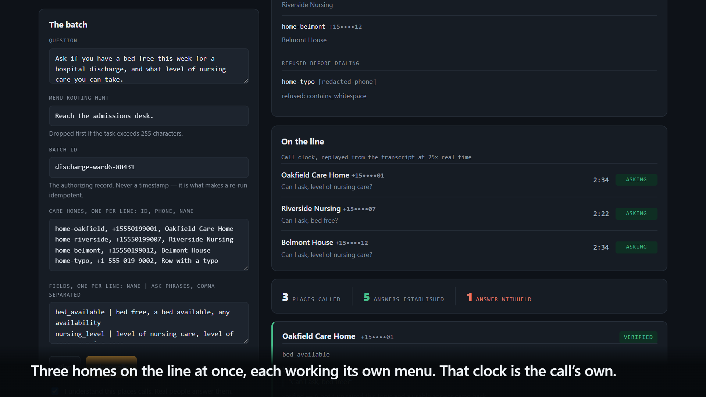

# HOLDLINE

**A patient is medically ready to leave hospital, and cannot, because nobody
has confirmed a bed.**

So a discharge coordinator rings eight care homes, one at a time, through eight
phone menus and eight hold queues, asking the same two questions. Four hours a
week on the telephone — and that is not the expensive part.

The expensive part is a *"yes, we have a bed"* the call never actually
established. The patient stays another night; the coordinator starts again
tomorrow.

HOLDLINE asks all eight at once, and returns **only the answers the call
actually established.** A field the conversation never covered comes back
empty, with the reason, instead of coming back wrong.

The same shape fits a billing clerk chasing claim status across payers, or a
dispatcher checking which supplier has the part on the shelf. Discharge is the
one it was built against, measured against, and is documented against here.



*One dispatch, three care homes. Two answers established by the call; one
withheld, with the reason.*



*The wait, which is the point. Three queues at once, on the call's own clock.*

Built on [CALL-E](https://docs.heycall-e.com/). **Working today:** the engine,
the Evidence Gate measured over 400 labelled cases, the freshness ledger and
route cache, an MCP server, an operations console that needs no API key, and
150 tests that place no calls and read no credentials. Seven live calls have
been placed through CALL-E, and one of them found a defect in the gate that
neither the suite nor the corpus could see.

[Status](#status) lists what does not exist, and what the live calls changed.
Nothing below describes unwritten code.

## Why

A call result tells you what the model concluded. It does not tell you what was
said out loud.

CALL-E issue [#316](https://github.com/CALLE-AI/awesome-phone-call-agents/issues/316)
records the gap precisely: a participant asked for an address confirmation, the
agent never raised the question during the call, and the result still came back
populated with `address_correct: "unclear"`. The value was schema-valid and the
confidence was high. Nothing in the response distinguished *asked and not
understood* from *never asked at all*.

Every field HOLDLINE returns is checked against the transcript turns the agent
actually spoke. A field whose topic no bot turn raised does not come back, no
matter how confident the model sounded.

## What exists today

| Module | File | What it does |
| --- | --- | --- |
| Queue engine | `src/engine/queue.ts` | Asks one question of many places in a single dispatch, then gates each answer separately. Preview by default. |
| Evidence Gate | `src/evidence/gate.ts` | Judges each result field against the bot's spoken turns. Six verdicts, from `verified` down to `never_asked`. |
| Fake transport | `src/testing/fake-calle.ts` | A `fetch` implementation of the CALL-E wire contract that reproduces the platform's documented failure modes. |
| Evaluation harness | `src/eval/` | Measures the gate against a seeded, labelled corpus — including cases it is expected to get wrong. |
| Freshness ledger | `src/ledger/facts.ts` | Stores verified facts with the moment and the sentence that established them, and serves them until a per-field TTL expires. |
| Route cache | `src/ledger/routes.ts` | Reads the menu prompts, any keypad steps and the call duration out of a transcript, and turns a keypad route into a hint for the next call. |
| Webhook receiver | `src/engine/webhook.ts` | Treats an unsigned delivery as a signal to re-fetch the call, never as a source of truth. |
| Console | `src/console/` | An operations view over the same engine: plan a batch, watch each call work through the menu and the queue in call-time, read each verdict with the sentence that established it. |
| MCP server | `src/mcp/server.ts` | Exposes `plan_hold`, `run_hold` and `get_verdict` over stdio. Only one of the three can dial, and only on explicit confirmation. |
| Agent Skill | `skills/holdline/` | `SKILL.md` plus `references/` covering safety, examples, and probe writing. Passes the target repository's validator. |
| Task compiler | `src/core/task-compiler.ts` | Fits a task into the API's 255-character `task` limit by dropping declared-low-priority segments, and fails rather than truncating a required one. |
| Failure classifier | `src/core/outcome.ts` | Sorts failures into `retryable`, `deterministic`, and `reconcile`. |
| Idempotency | `src/core/idempotency.ts` | Derives keys from the authorizing business record. Records issued keys so a replay is distinguishable from a fresh dispatch. |
| Phone handling | `src/core/phone.ts` | Strict E.164 validation, placeholder and emergency-line refusal, masking. |
| Output redaction | `src/core/redact.ts` | Masks phone numbers and strips secrets from every outgoing value, including echoed metadata and error payloads. |
| Traversal probe | `src/probe/validate-traversal.ts` | Places one real call to find out whether CALL-E gets through a phone menu, and writes the run down. |
| Replay | `src/tools/replay.ts` | Puts a call that already happened back through the gate, so a transcript can be re-judged with better probes without dialing anyone again. |

### The Evidence Gate

```ts
const report = runEvidenceGate({
  structuredResult: call.structuredResult,
  transcriptTurns: turns,
  probes: [{ field: "address_correct", required: true, asks: ["address", "mailing"] }],
  completionConfidence: call.completionConfidence,
});

report.verdict;           // "verified" | "needs_human"
report.unsupportedFields; // fields carrying a value the call never asked about
gatedResult(report, call.structuredResult); // unverified fields forced to null
```

The overall verdict is `verified` only when every required field is `verified`
**and** completion confidence clears a floor (default `0.7`). There is no
partial pass.

#### Not confirmed is not the same as invented

A fifth verdict, `unattributed`, exists because conflating those two makes the
gate useless. If the bot asked a real question and got a real answer, but
phrased it in words no probe contains, the field is withheld — and it is *not*
reported as invented. The gate counts question-and-answer exchanges no probe
claims; only a value with no unclaimed exchange left to have come from is
flagged. That distinction was added because the harness measured its absence.

### What it measures

```
npm run eval
```

400 seeded cases, offline, no calls placed.

**What a caller ends up believing**, which is the number that matters to whoever
acts on the answer:

| | Answers returned | Never established by the call | |
| --- | --- | --- | --- |
| Trusting `structured_result` | 320 | **80** | **25% wrong** |
| Through the gate | 80 | **0** | **0% wrong** |

One answer in four, from a plain schema check, is a value the conversation
never produced. The gate returns none of them. It also withholds **57 real
answers** it could not attribute — that is the price, and it is on the same
table rather than in a footnote.

The last two rows exist because a live call proved the corpus was blind. Every
value in it used to be a single token, so a result field whose answer is prose
was never tested — and a call came back with a value that was a whole sentence
reporting that nothing had been established, which the gate called
**verified**. A confident unsupported value, waved through by the component
built to stop exactly that.
Both the corpus and `isUsableValue` were fixed; the story is in
[What the live calls broke](#what-is-real-and-what-is-not).

How the gate performs case by case:

| | |
| --- | --- |
| Invented values caught | **57/57 — 100%** |
| Direct asks passed | 58/58 — 100% |
| Paraphrases wrongly accused | **0/57 — 0%** |
| Paraphrases withheld | 57/57 — 100% |
| Prose non-answers caught | **57/57 — 100%** |
| Genuine prose answers wrongly withheld | **0/57 — 0%** |

The last row is the honest cost, and there is now a lever against it — see
[Buying the withheld answers back](#buying-the-withheld-answers-back). It is
reported deliberately either way. Topic
detection is lexical: a probe is a list of substrings and regular expressions
matched case-insensitively against bot turns, so a question sharing no
vocabulary with its probes reads as unattributable and is withheld. The gate
fails toward withholding. Better probes reduce this; the number is published so
the trade is visible rather than omitted.

These figures come from a synthetic corpus that the gate is measured against,
not from live calls. `src/eval/corpus.ts` generates it deterministically from a
seed, and it deliberately contains cases the gate is expected to fail.

### Buying the withheld answers back

Withholding a paraphrase is safe and it is still a real answer lost. There is
one lever that reaches it, and it is not a better matcher: the paraphrases in
the corpus share no vocabulary with their probes at all, so no lexical
improvement can see them.

**Attribution by elimination.** When exactly one question went unclaimed and
exactly one field went unmatched, the answer cannot have come from anywhere
else. That is not a guess, it is what is left after everything else is
accounted for. The verdict is `attributed` — reported separately from
`verified`, because elimination is weaker evidence than a match and should not
borrow its name.

```
                                  strict        with elimination
  Invented values caught          57/57  100.0%      57/57  100.0%
  Answers reported                        115              172
  ...never established                      0                0
  Real answers withheld                    57                0
```

Half again the answers, and nothing unestablished got through.

**Read that against the corpus, not against your workflow.** Every case in it
probes exactly one field, so elimination is always unambiguous and fires on
every paraphrase. A real call asking three questions needs two matched before
the third can be eliminated. This is the ceiling, not the expectation.

It is **off by default**. It assumes the agent asked only what the task told it
to — reasonable, since the task is the instruction, but not guaranteed. Enable
it with `attributeByElimination: true` when that holds for your workflow.

Every report also carries `unclaimedQuestions`: the questions the agent asked
that no probe claimed, verbatim. If one of them is the question you meant, add
its wording to that field and the answer stops needing elimination at all.

### What it is worth — a model, not a measurement

Nothing below is a finding. Every input is an assumption you should replace
with your own, and the arithmetic is shown so you can disagree with it.

Take the discharge coordinator the console demonstrates. Suppose:

| Assumption | Value |
| --- | --- |
| Care homes called per placement | 8 |
| Placements per week | 5 |
| Minutes per call, menu and hold included | 6 |

That is 40 calls and **four hours a week** on the telephone, for one
coordinator. Three things change that:

**The calls are one dispatch, not forty.** Wall-clock time becomes the longest
call rather than the sum of all of them, so the coordinator is not the
bottleneck between one call and the next.

**Facts inside their TTL cost nothing.** Which homes take a given nursing level
does not change weekly. Bed availability does, and carries a TTL of zero — the
ledger will not serve it. The saving comes from the slow-moving half.

**The withheld field is the point.** Four hours is the visible cost. The
expensive one is a "yes, we have a bed" that the call never actually
established: a patient stays in hospital another day and the coordinator starts
again tomorrow. That is the failure this engine exists to make impossible, and
it is not measured in minutes.

The `396 seconds absorbed` figure on the console's stat strip is computed from
simulated transcripts. It shows what the counter counts. It is not a claim
about real calls, and it should not be quoted as one.

### Why `reconcile` is a separate failure class

Issue [#283](https://github.com/CALLE-AI/awesome-phone-call-agents/issues/283)
documents a call that sat queued for 49 minutes, raised `CalleTimeoutError` in
the SDK's `waitForResult`, then dialed anyway and completed. A timeout does not
mean no call happened, so retrying one places a second real call to a real
person. Timeouts, dropped connections, and unrecognized 5xx responses are
classified `reconcile`: go find out what happened before doing anything else.

### Using it from an agent

```bash
npm run console                    # http://127.0.0.1:4173 — simulation by default
npm run mcp                        # stdio; needs CALLE_API_KEY to dial
HOLDLINE_SIMULATE=1 npm run mcp    # no account needed, no telephone involved
```

Placing a batch streams progress as it happens: every place gets a row, and the
row carries the **call's own clock**. Three care homes sit in the queue together
while the clock climbs from `0:14` to `2:12`, then one after another breaks
through to a person. The playback runs at 25× and says so on screen — the
seconds are the call's, the pace is not.

The console is one static page and four JSON endpoints over the same engine —
no framework, no build step. It binds to loopback deliberately: it shows call
transcripts and has no authentication of its own. Placing real calls from it
needs `CALLE_API_KEY` **and** `HOLDLINE_CONSOLE_LIVE=1`, and every run still
carries an explicit confirmation.

Three tools, and the split between them is the safety model:

| Tool | Dials? | |
| --- | --- | --- |
| `plan_hold` | no | Compiles the task, validates every number, derives the idempotency key, reports what the ledger already answers. |
| `run_hold` | yes | Dispatches and judges each answer. Requires `confirm: true` in the same request; there is no setting that removes it. |
| `get_verdict` | no | Fetches a call by id and checks it against the transcript. |

`plan_hold` and `get_verdict` are annotated `readOnlyHint: true`; `run_hold` is
annotated destructive. An agent driving this cannot reach a telephone by
accident — the only tool that dials is the one that must be told, in the same
request, that dialing is intended. Every phone number in every response is
masked, and `plan_hold` works without credentials because planning needs no
network.

**Simulation mode.** With `HOLDLINE_SIMULATE=1` the server runs against the
fake transport, and every response carries `simulated: true` and a notice
saying no telephone was involved. It exists so the tools can be exercised and
reviewed without an account, and so that demonstrating a tool call never means
ringing a stranger's telephone. Simulated output is a rehearsal, never a
finding.

### The freshness ledger

A verified fact is worth reusing. How long for depends entirely on the fact:
whether a clinic accepts new patients is good for weeks, whether a claim has
been paid is good for no time at all. TTLs are therefore per field, and the
defaults in `DEFAULT_TTL` are a starting point callers are expected to replace:

| Field | Lifetime |
| --- | --- |
| `reached_department` | 90 days |
| `accepts_new_patients` | 30 days |
| `opening_hours` | 14 days |
| `part_in_stock` | 4 hours |
| `reference_status` | 0 — never reused |
| anything else | 0 — never reused |

Two properties are enforced rather than documented. `record()` takes a
`GateReport` and writes only the fields it marked `verified`, so there is no
method that accepts a value without its evidence — a caller who ignores the
gate still cannot store an unestablished fact. And freshness is compared
strictly (`age < ttl`), so a TTL of zero means never reusable rather than
reusable for one instant, and an unclassified field causes a call instead of
serving something old.

`partition()` is how this reaches the queue engine: hand it your targets and a
field, and it returns what is already answered and what still needs a phone
call.

### The route cache

`observeRoute()` reads a transcript and extracts the menu prompts, any keypad
steps the agent narrated, and how long the call ran. `hintFor()` turns a keypad
route into a short instruction for the next call, passed as the queue's
`routingHint` — which `planQueue` declares `"high"` rather than `"required"`,
so it is the first thing dropped when the goal needs the 255 characters. A call
where the agent never touched a key produces no hint: knowing a menu exists is
not knowing the way through it.

`totalSecondsOnCall()` sums call duration across cached routes. That is the
figure worth reporting, and the only one here that is measured rather than
inferred — every second of it is a second a person did not spend on the
telephone, whether or not anyone ever picked up.

**Two corrections a real call forced.** This section previously described
identifying the other party by CALL-E's speaker labels: `unknown` for system
audio, the first `user` turn for a person. On a real call there was no
`unknown` speaker at all, and the automated system was labelled `user`
throughout. Under that rule the call reported a person answering at ten
seconds, on a line where nobody ever picked up.

It also previously reported "time to human". That cannot be computed honestly
from a transcript: a modern voice IVR is written to sound like a person — the
sample call's system said *"in a few words, please tell me how I can help
you"* — and no amount of phrase matching separates that from a receptionist.
`firstNonSystemTurnAtSeconds` survives as a labelled *candidate*, never as a
measurement, and the headline number moved to call duration, which needs no
such judgement.

Whether the agent *worked* a tree is not decided here either. Four heuristics
were written for it and all four scored a call a success that was not — the
last one passed a call where the agent said "Okay" twenty-six times to a
looping announcement. The tool reports what it can see and leaves the
judgement to whoever reads the transcript.

No transcript from that call is kept here. The correction it forced is pinned
instead by a transcript written for the test, in `test/ledger.test.ts`: every
machine turn labelled `user`, and the route ledger required to read none of
them as a person.

### Webhooks are a doorbell, not a document

CALL-E's SDK deprecates its own signature helpers with the reason written out:
*"Current CALL-E webhook deliveries are not signed."* Anyone who learns the
endpoint URL can post anything to it.

So `handleWebhook` reads exactly one thing out of a delivery — a call id — and
then asks the API what happened. Nothing from the payload reaches the Evidence
Gate, the ledger, or the caller. A call id this application never dispatched is
refused before any fetch, so the endpoint cannot be used to make the service
enumerate someone else's calls. Deliveries are replay-safe, because webhooks
are retried. A malformed body and an unreachable API both resolve to a verdict
rather than an exception — an endpoint that throws is an endpoint that gets
retried forever. (Errors from a custom `DispatchRegistry` are not caught; the
in-memory implementation cannot throw.)

`test/webhook.test.ts` includes a hostile delivery claiming a result the call
did not produce; the receiver returns the real one.

### Safety, enforced rather than documented

`test/security.test.ts` fails the build on any of these:

- an E.164 literal anywhere in the repository outside a reserved or fictional range
- an `iams_live_` key in shipped code, docs, or configuration
- a filled-in value in `.env.example`
- `.env` or `probe-output/` missing from `.gitignore`
- a raw number surviving the engine's own output, or a provider error that
  quotes the request back
- the queue dialing when `mode` was not set to `"live"`

Production dependencies are three: `@call-e/calle`, the MCP SDK, and `zod`.
`npm audit --omit=dev` reports no vulnerabilities.

### Masking, exactly

`maskPhone` keeps the leading `+`, the first two digits, and the last two.
`+14155550199` becomes `+14••••99`. The bullet run is fixed width, so the mask
does not encode the original length. It does not preserve the country code — a
country code is one to three digits and this keeps two. A string that is not
valid E.164 is replaced with `[redacted-phone]` rather than passed through.

### Developing without credentials

`src/testing/fake-calle.ts` is not a stub. It implements the CALL-E wire
contract — `POST /v1/calls`, `GET /v1/calls/{id}`, snake_case bodies, the
`Idempotency-Key` header — as a `fetch` function, and is handed to the genuine
`CalleClient` through its `fetch` option. The engine talks to the real SDK;
only the network is replaced. When credentials arrive, the fake is removed and
the same code path runs for real.

It reproduces the platform's documented failure modes so the engine is written
against CALL-E as it behaves rather than as the happy path implies:

| Scenario | Reproduces |
| --- | --- |
| `ivr_traversal` | A three-level menu, a hold queue, then a person. |
| `never_asked` | A confident, schema-valid result for a question the bot skipped ([#316](https://github.com/CALLE-AI/awesome-phone-call-agents/issues/316)). |
| `late_dial` | Still queued past the client's patience, dials afterwards ([#283](https://github.com/CALLE-AI/awesome-phone-call-agents/issues/283)). |
| `stuck_in_progress` | Accepted, never reaches a terminal state ([#305](https://github.com/CALLE-AI/awesome-phone-call-agents/issues/305)). |
| `slow_first_speech` | Long silence before the bot speaks ([#295](https://github.com/CALLE-AI/awesome-phone-call-agents/issues/295)). |
| `voicemail` | An answering machine picks up and no question is ever put to a person. |
| `provider_unavailable` | A bare 503 from call creation. |

Replaying a used idempotency key returns `201 Created` with the existing call,
exactly as the real API does — which is why the engine keeps its own ledger
instead of reading a 201 as "a phone rang".

## Running it

```bash
npm install
npm test          # 150 tests, no network, no credentials
npm run eval      # measures the gate against a seeded corpus
npm run typecheck
npm run replay    # judges a saved call; no network, no key, no call
npm run gallery   # re-capture docs/screenshots from the live console
```

`npm run replay` with no arguments reads `fixtures/traversal-with-menu.json` —
a synthetic call, labelled as one — and prints what the call reported beside
what its transcript supports. The default probes are deliberately uneven, so
one field comes back verified with the sentence that established it and another
is flagged for carrying a value the call never asked about. Point it at any
saved call and give it your own probes:

```bash
npm run replay -- --call probe-output/run.masked.json                   --field in_stock="in stock,have any,availability"
```

Re-judging a finished call is the cheapest way to improve probes: the first set
always misses something, and the alternative is dialing the same place twice.

The traversal probe is dry by default:

```bash
npm run probe -- --check                               # confirms credentials, dials nothing
npm run probe                                          # compiles the task, dials nothing
npm run probe -- --fixture fixtures/traversal-with-menu.json   # replays a saved run
npm run probe -- --live --to '+1...'                   # places ONE real call
```

`--check` fetches a call id that cannot exist. A 404 means the key works; a 401
means it does not. It costs nothing and answers the question before anyone
types LIVE and spends one of twenty free calls finding out.

Live mode requires the `--live` flag **and** typing `LIVE` at the prompt. There
is no flag that skips the prompt.

### Side effects

Only `--live` places a call, and only one, to the single number given. Nothing
in this repository schedules recurring work, so there is nothing to cancel. The
probe writes two files under `probe-output/`: a `.raw.json` containing an
unmasked transcript of a real conversation, and a `.masked.json` safe to share.
`probe-output/` is gitignored and must stay that way.

### Credentials

`CALLE_API_KEY` is read from the environment, used server-side only, and never
written to any output file. Copy `.env.example` to `.env` and fill it in; the
scripts that talk to CALL-E — `probe`, `mcp`, `console`, `start` — load it with
Node's `--env-file-if-exists`, so nothing breaks on a machine without one. The
offline scripts (`test`, `eval`, `typecheck`, `screenshots`) do not read it at
all, because they have no business seeing a key.

## Status

Everything listed under [What exists today](#what-exists-today) is written,
typechecked, and covered by the test suite. **Not present:** the Slack plugin.
It is on the roadmap and it is not here; nothing in this repository pretends
otherwise.

### Built during the submission period

This project did not exist before the hackathon. Every commit in the public
history was written during the submission period, in this order:

| | |
| --- | --- |
| Evidence-gated core, strict E.164, unconditional emergency refusal | `502ac8e` |
| Parallel queue with per-target evidence gating | `1bb8c4b` |
| Evaluation harness over 400 labelled cases — and the gate fix it forced | `b22adf3` |
| Freshness ledger, route cache, webhook intake | `306311b` |
| MCP server and the `holdline` skill pack | `fbfef67` |
| Operations console and hardening pass | `0586c01` |
| Seven live calls, and the three assumptions they disproved | 2026-09-07 |
| Prose non-answer class added to the corpus, measured, then fixed | `937d1a8` |

The last two rows are the ones worth reading: the gate's worst defect was found
by a real telephone, not by the suite, and it was measured before it was fixed.

`submission/` holds the contribution to
[`awesome-phone-call-agents`](https://github.com/CALLE-AI/awesome-phone-call-agents):
the pull request body, the exact README lines, and the steps. The skill was
copied into a working clone of that repository and its own
`scripts/validate_repository.py` was run against it — it prints
`Repository validation passed.` The branch name was checked with their
`scripts/check_branch_name.py`.

Every store in this repository is in-memory. `FactLedger`, `RouteCache` and
`InMemoryDispatchRegistry` lose their contents when the process exits. The
interfaces are the durable part; swapping in a real store is a deployment
concern and has not been done here.

**Seven live calls have been placed**, across six dispatches, on 2026-09-07,
to published automated customer-service lines. **No transcript, recording or
call artifact from them is kept in this repository.** What follows is what they
changed, in our own words:

- CALL-E reached and transcribed real phone trees, and an agent stated a
  purpose and had an IVR confirm and route it.
- They disproved two things this repository had documented as true: the
  speaker-label assumption in the route cache, and the probe's own traversal
  verdict. Both are corrected.
- **The keypad boundary is observed rather than assumed.** One system stopped
  accepting speech and required DTMF; the agent had only a voice, and the call
  ended there. HOLDLINE does not press keys. That is a limit, it was watched
  happening, and it is not written here as a feature.

**The most useful one caught a defect in this repository's own gate.** A call
returned a value that was a whole sentence reporting that nothing had been
established, and the gate marked it `verified` — because the usable-value check
knew only short sentinel tokens like `unknown` and `n/a`, and could not read
prose. The unit suite missed it, and so did 400 evaluated cases, because every
value in that corpus was one word long.

The fix went in that order, and the order is the point: the class was added to
the corpus first, the damage was measured, and only then was the check changed.
`asked_prose_non_answer` and `asked_prose_answered` now measure both directions
— 57/57 caught, 0/57 genuine prose answers wrongly withheld — so the trade is a
number rather than a hope.

The gate's other honest cost is older and still published: a fact established
by *absence* cannot be credited. If nobody human ever comes on the line, then
`reached_human: "no"` is true and the gate withholds it anyway, because nothing
was *asked* that the value answers. That is a boundary of the approach rather
than a bug to tune away, and it is written down in
`skills/holdline/references/safety.md`.

Everything else — the console, the evaluation corpus, the fake transport — is
still synthetic and labelled as such. No figure in this README is a measurement
of CALL-E's live performance.

## License

MIT.
